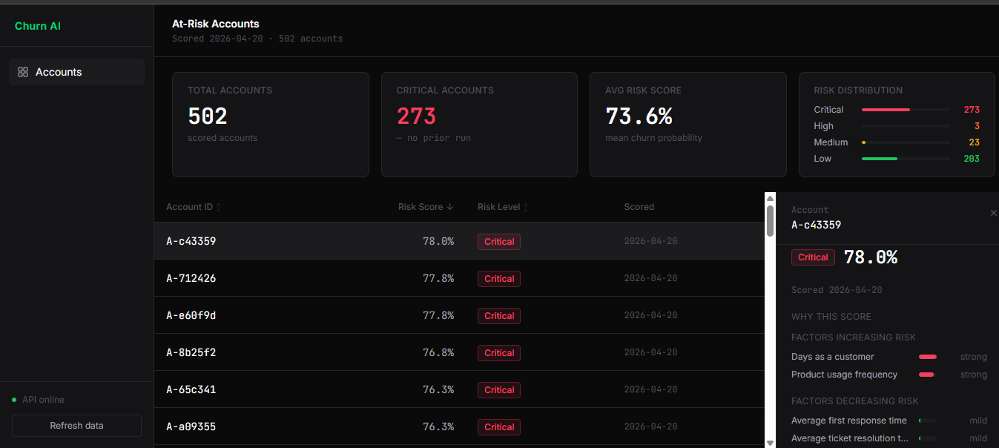

# Churn AI — SaaS Churn Prediction System

Predicts which SaaS customers are about to churn, explains why, and surfaces them in the CRM the team already uses.

**Live demo:** [Dashboard](https://sg-churn-ai.vercel.app) &nbsp;|&nbsp; [API docs](https://churn-prediction-4i3q.onrender.com/docs) *(cold start ~30s)*

---

## Screenshot



---

## How it works

A batch scorer reads subscription, usage, and support-ticket data, engineers 20+ features (tenure, usage frequency, ticket volume, tier changes), and runs a Random Forest model to produce a churn probability for every active subscription. Predictions are persisted to SQLite and exposed through a FastAPI service: `/accounts` returns the ranked account list for the dashboard, and `/explain/{id}` returns precomputed SHAP top-5 factors so Customer Success can see *why* an account is flagged, not just *that* it is. A Next.js dashboard gives the CS team a live ranked view with a slide-in detail panel per account showing the SHAP chart, risk badge, and one-click actions (view in HubSpot, email, book a call). A sync script pushes predictions to HubSpot Company records so the risk data lives inside the CRM the team already uses, with no extra login required.

---

## Tech stack

Python 3.12, scikit-learn (Random Forest, 400 trees), SHAP (TreeExplainer), FastAPI, SQLite + SQLAlchemy, Airflow (DAG, code-only), HubSpot API, Next.js 15, React 19, Tailwind CSS v4, TypeScript, GSAP, Render (API hosting), Vercel (dashboard hosting)

---

## Run it locally

**Requirements:** Python 3.12+, Node 18+

```bash
# 1. Clone and install Python dependencies
git clone https://github.com/Simeon-gab/churn-prediction.git
cd churn-prediction
python -m venv .venv
source .venv/bin/activate        # Windows: .venv\Scripts\activate
pip install -r requirements.txt

# 2. Configure env vars
cp .env.example .env
# Edit .env — HUBSPOT_ACCESS_TOKEN and HUBSPOT_PORTAL_ID are only needed
# if you want to run the HubSpot sync script. The API and dashboard work
# without them (the HubSpot URL button in the dashboard will be disabled).

# 3. Start the API (the DB and model are already in the repo)
uvicorn api.main:app --host 127.0.0.1 --port 8000 --reload

# 4. Start the dashboard (in a second terminal)
cd dashboard
npm install
npm run dev
```

Create `dashboard/.env.local` with:
```
FASTAPI_BASE_URL=http://127.0.0.1:8000
NEXT_PUBLIC_FASTAPI_BASE_URL=http://127.0.0.1:8000
NEXT_PUBLIC_BOOKING_URL=https://calendly.com/your-link
```

Open [http://localhost:3000](http://localhost:3000) for the landing page and [http://localhost:3000/dashboard](http://localhost:3000/dashboard) for the CS view.

---

## Known limitations for v1

**Frozen data.** The deployed API serves data from `data/churn.db`, which is committed to the repo and reflects a single scoring run. There is no scheduled retraining or rescoring in the deployed environment. A real production setup would use Postgres with a scheduled nightly scorer running on Airflow.

**Cold start on Render free tier.** The API goes to sleep after 15 minutes of inactivity. The first request after sleep takes roughly 30 seconds. Subsequent requests are fast. Grab a coffee on the first click.

**Account rollup over-flags multi-subscription accounts.** Account-level risk is computed by taking the highest-risk subscription per account. On this dataset, 53.7% of accounts are flagged Critical at the account level, versus 7.8% at the subscription level. A v2 ARR-weighted rollup would reduce the false-positive rate.

**Airflow DAG is code-only.** The DAG in `dags/churn_scoring_dag.py` is written and tested but is not running on a live Airflow instance. Scheduling is simulated locally via cron.

---

## What v2 would do differently

- **Postgres** instead of SQLite, with a managed connection pool (PgBouncer or Supabase)
- **Managed Airflow** (Astronomer or AWS MWAA) for production-grade scheduling and observability
- **Containerized FastAPI** with JWT auth and per-tenant data scoping for multi-tenant SaaS deployments
- **XGBoost** with Optuna hyperparameter search, replacing the Random Forest baseline
- **Real-time event ingestion** via Kafka or Segment webhooks, so the churn score updates within hours of a usage drop rather than the next day
- **ARR-weighted account rollup** to reduce over-flagging of multi-subscription accounts

---

## Architecture


*Diagram coming soon.*

---

## Contact

Built by Gabriel Simeon — design engineer working on ML systems and creative web experiences.

- GitHub: [@Simeon-gab](https://github.com/Simeon-gab)
- Portfolio: [ayotomcs.me](https://ayotomcs.me)
